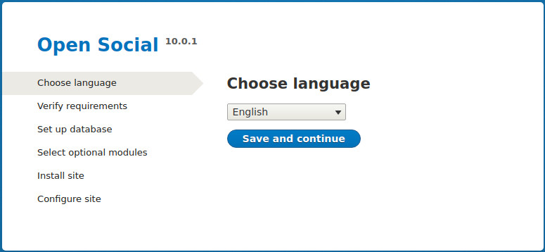
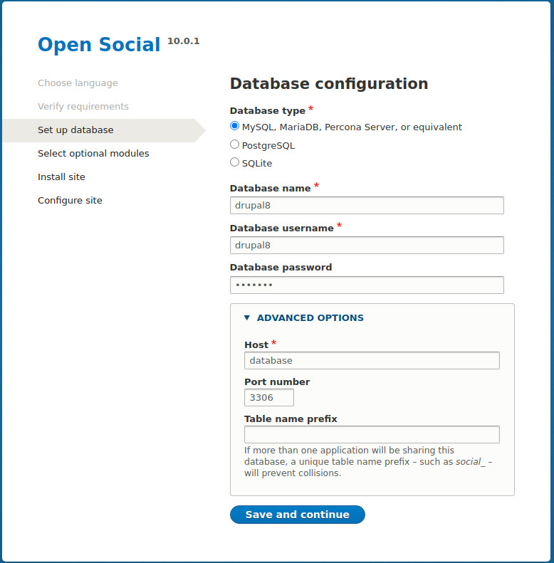
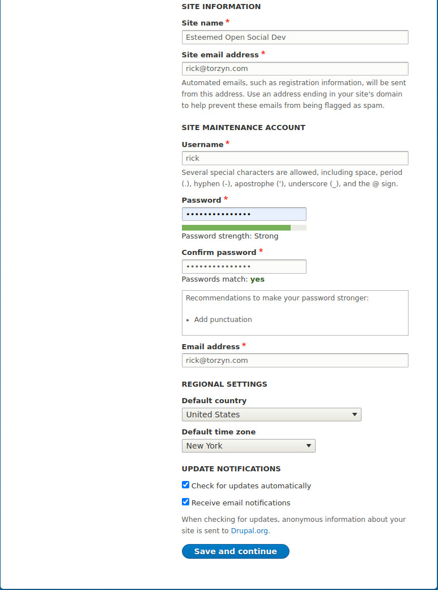
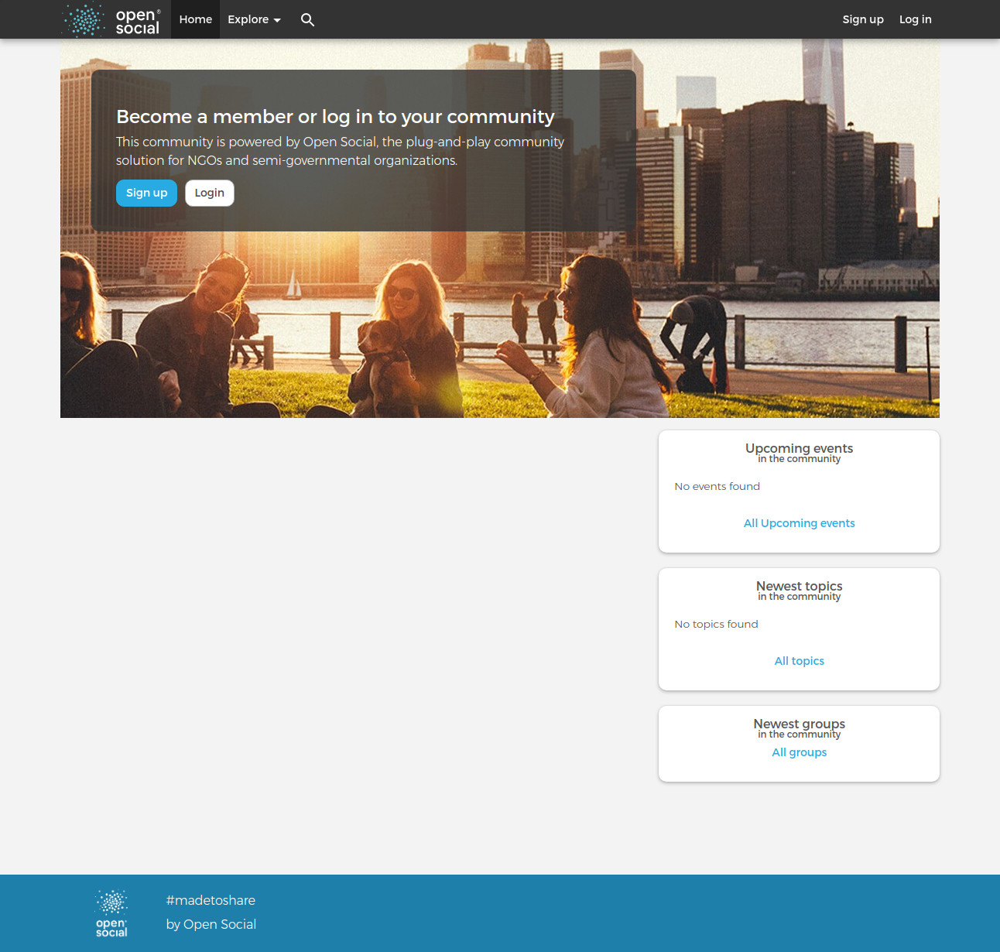

# Open Social Local Dev Using Lando

This repo can be used in setting up a local dev environment using [Lando](https://lando.dev/) for [Open Social](https://drupal.org/project/social).

## Prerequisites

1. [Composer](https://getcomposer.org/download/) installed locally.
2. [Lando](https://lando.dev/) installed locally.

## Installation of Open Social for Lando

```
$ git clone https://github.com/ricktorzynski/lando-esteemed-opensocial
$ cd lando-esteemed-opensocial
$ composer install
$ lando init
```
For the install and note the root directory is "html" and not "web"
```
From where should we get your app's codebase? current working directory
What recipe do you want to use? drupal8
Where is your webroot relative to the init destination? html
What do you want to call this app? esteemed-open-social
```
Start Lando up to create docker containers
```
$ lando start
```
Boomshakalaka!!!
You will be shown the site url:
```
 NAME            lando-esteemed-opensocial                        
 LOCATION        /home/rick/Lando/lando-esteemed-opensocial       
 SERVICES        appserver, database                              
 APPSERVER URLS  https://localhost:32790                          
                 http://localhost:32791                           
                 http://lando-esteemed-opensocial.lndo.site:8080/ 
                 https://lando-esteemed-opensocial.lndo.site/    
```
Go to the URL in your browser and commence the install.

### Choose Language



### Database Configuration


For database name, user and password, use drupal.  Click on ADVANCED OPTIONS and set Host to database.

### Install Optional Modules

Select options you want to include - I chose all of them!

### Configure Site


This screen does have errors, but you can ignore them from now.  I will address these later.

### Homepage



### Install issues for Open Social
[documentation](https://www.drupal.org/docs/8/distributions/open-social/installing-and-updating)

### Installing outside of HTML folder
[See this issue for more information](https://www.drupal.org/project/social/issues/2792543#comment-11591981)


